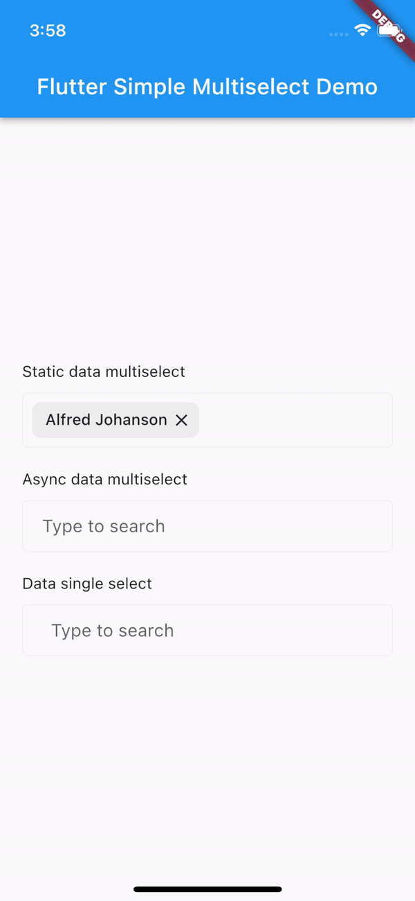
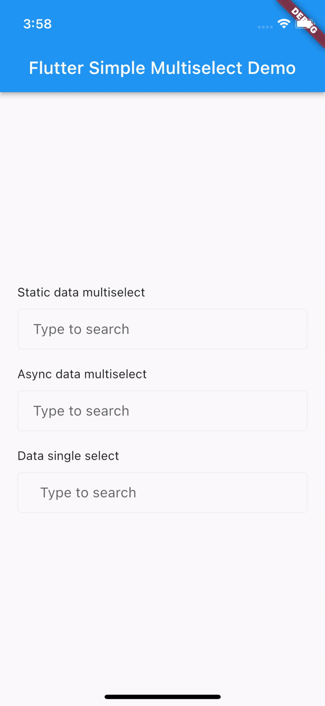
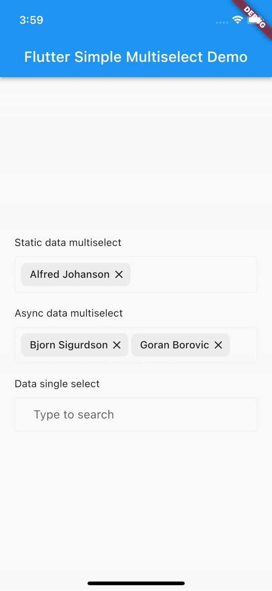

# Flutter Simple Multiselect

`v1.0.0`

There are a few multiselect packages for flutter but somehow somehow i haven't found one that is simple like this. It's inspired by the vue multiselect. You can use static or async (server) data and use it as searchable single or multiselect.

Note: This package is created on the backbone of [Material Tag Editor](https://github.com/panuavakul/material_tag_editor).

## Features

Fetch and search async data directly from server or from static data. Use it for multiselect and single, and use it somehow naturally.

<p float="left">
  
  
  
</p>

## Usage

Add the package to pubspec.yaml

```dart
dependencies:
  flutter_simple_multiselect: x.x.x
```

Import it

```dart
import 'package:flutter_simple_multiselect/flutter_simple_multiselect.dart';
```

Full examples for all three options are in `/example` folder so please take a look for working version.

Use widget: (Async ultiselect sample)

```dart
FlutterMultiselect(
    multiselect: true,
    autofocus: false,
    padding: const EdgeInsets.symmetric(horizontal: 8, vertical: 0),
    enableBorderColor: lineColor,
    focusedBorderColor: lineColor,
    borderRadius: 5,
    borderSize: 1,
    resetTextOnSubmitted: true,
    minTextFieldWidth: 300,
    suggestionsBoxMaxHeight: 300,
    length: selectedItemsAsync.length,
    isLoading: isLoading,
    tagBuilder: (context, index) => SelectTag(
            index: index,
            label: selectedItemsAsync[index]["name"],
            onDeleted: (value) {
            selectedItemsAsync.removeAt(index);
            setState(() {});
            },
        ),
    suggestionBuilder: (context, state, data) {
        var existingIndex = selectedItemsAsync.indexWhere((element) => element["uuid"] == data["uuid"]);
        var selectedData = data;
        return Material(
            child: ListTile(
                selected: existingIndex >= 0,
                trailing: existingIndex >= 0 ? const Icon(Icons.check) : null,
                selectedColor: Colors.white,
                selectedTileColor: Colors.green,
                title: Text(selectedData["name"].toString()),
                onTap: () {
                var existingIndex = selectedItemsAsync.indexWhere((element) => element["uuid"] == data["uuid"]);
                if (existingIndex >= 0) {
                    selectedItemsAsync.removeAt(existingIndex);
                } else {
                    selectedItemsAsync.add(data);
                }

                state.selectAndClose(data);
                setState(() {});
                }));
    },
    suggestionsBoxElevation: 10,
    findSuggestions: (String query) async {
        setState(() {
        isLoading = true;
        });
        var data = await searchFunctionAsync(query);
        setState(() {
        isLoading = false;
        });
        return data;
    })
```
